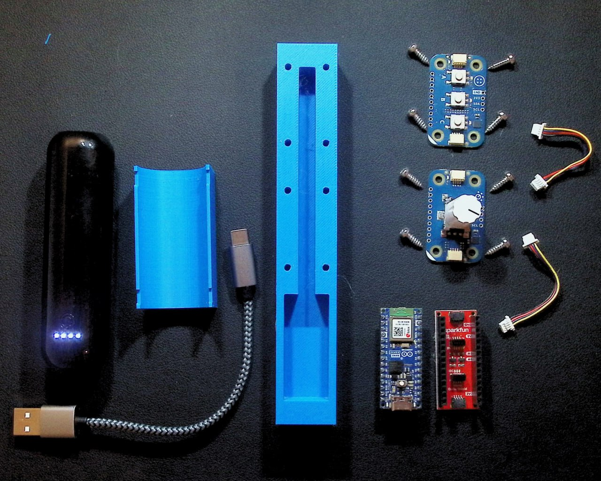
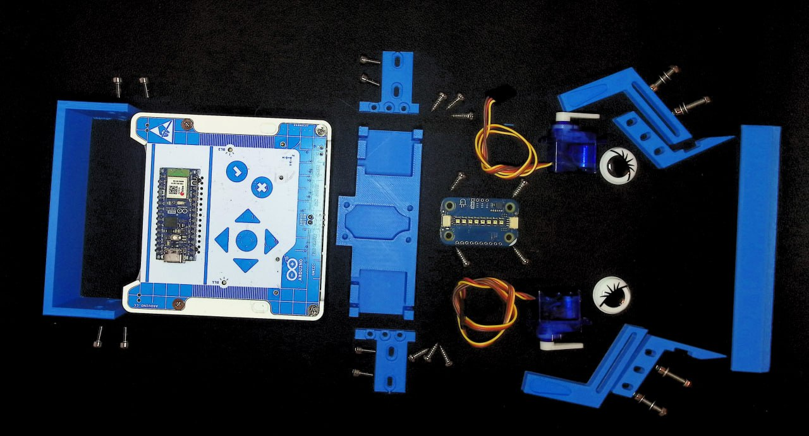

# alvik-fight-club

>
> The first rule about the Alvik fight club:
> Don’t talk about the Alvik fight club.
>

The project is composed by two components:
 - a remote controller
 - an Alvik robot

## Setup

- `make init` to install tools on local pc

### Configure the Alvik robot
1. Connect the usb-c to the Alvik and turn on it
2. `make robot-patch-firmware`: to upload the patched firmware running on the STM32 (needed to resolve [Issue 10](https://github.com/bcmi-labs/alvik-fight-club/issues/10))
3. `make robot-patch-mpy`: to install the `dev` branch of the arduino-alvik-mpy code in the robot (needed to resolve [Issue 10](https://github.com/bcmi-labs/alvik-fight-club/issues/10)) and [Issue 38](https://github.com/bcmi-labs/alvik-fight-club/issues/38).
4. `make robot-install` to upload the `Modulino` lib
5. `make robot-upload` to upload the code into the alvik
6. check if the robot is: shows red leds animation on black surface, and steady green leds on white surface.
7. `make robot-get-mac` to get the `MAC` address and print it into the console
8. Copy the printed MAC address

Wiring
- right motor connected to upper pin
- left motor connected to lower pin

MAC of Robots (Maker Fair Rome 2024):
- Livia robot: `74:4d:bd:a2:08:74` previous mac was `74:4d:bd:7e:28:70`
- Stefano robot `74:4d:bd:a2:1b:bc`
- Davide robot: `74:4d:bd:a2:27:08`
- Alessia robot:`dc:da:0c:22:eb:94`

NOTE: the PATCH steps `2` and `3` are no more necessary when the [Arduino_AlvikCarrier](https://github.com/arduino-libraries/Arduino_AlvikCarrier) and the [Arduino-Alvik-mpy](https://github.com/arduino/arduino-alvik-mpy) are merged.

#### Color calibration mode
The robot exposes a `color calibration mode` that can be activated by pressing the `ok` button.
The robot guides the calibration using different lights code showed on the Modulino Pixels.
The user must move the robot on WHITE and BLACK color surfaces when a specific lights code is shown.

Steps to calibrate the robot
0. Prepare a WHITE and BLACK surface
1. Switch on the robot
2. Press the `ok` button to enter into the `calibration mode`. The mode has the following light codes
   - WHITE leds countdown: indicate that the robot must be put on WHITE color. At the end of the countdown, the robot calibrates the WHITE color.
   - BLUE leds countdown: indicate that the robot must be put on BLACK color. At the end of the countdown, the robot calibrates the BLACK color
   - the robot automatically reset itself.

### Configure the controller
1. Connect the controller
2. Install Micropython into the controller
   - Download the [Micropython Installer](https://labs.arduino.cc/en/labs/micropython-installer)
   - Open the installer and clik  `Install Micropython` button
4. `make controller-install` to install libraries into the controller
5. `make controller-upload robot-mac=<PUT_THE_ALVIK_MAC_HERE>` to upload the code and setting the MAC address obtained with the `make robot-get-mac` (Step 7 of Configure the Alvik robot).
       Example: `make controller-upload robot-mac=74:4d:bd:a0:49:e8`

## Techninal info

###  Remote controller
The remove controller is based on  `Arduino Nano ESP32` and two `Modulino` (Pixels and Knob).

  

The remote control consists of the a 3D printed base [STL-file](cad/remote-control/remote-control.stl) and the following components:
|   | Description | Amount / € |
|---|---|:-:|
| 1 | [Arduino Nano ESP32 w/ headers](https://store.arduino.cc/products/nano-esp32-with-headers) | 23,20 € (Arduino) |
| 1 | Modulino buttons | Arduino |
| 1 | Modulino rotary encoder | Arduino |
| 2 | QWICC cables | Arduino |
| 1 | [SparkFun Qwiic Shield for Arduino Nano](https://www.sparkfun.com/products/16789) | 2,48 € |
| 8 | [M3 x 8 mm cutting screw](https://www.schraubenking.at/3-x-8mm-Flachrundkopfschraube-TX-fuer-Thermoplaste-P007210) | 1,20 € |
| 1 | [Small USB battery pack](https://www.amazon.it/alimentazione-rossetto-Portable-caricabatterie-cellulari/dp/B0BHZ6RY6C) | 10€ |
| 1 | 3D printed body | |

### Alvik robot

  

The robot is an Alvik  requires the following components:
|   | Description | Amount / € |
|---|---|:-:|
| 1 | [Arduino Alvik](https://www.arduino.cc/education/arduino-alvik/) | 158,60 € (Arduino) |
| 1 | Modulino Pixel | Arduino |
| 1 | QWICC cables   | Arduino |
| 2 | Servo motor (180 degree) | ~8€ |
| 2 | Lift arm scoop mount [CAD](cad/robot/lift-arm-scoop.stl) | @aentinger |
| 2 | Lift arm servo mount [CAD](cad/robot/lift-arm-servo.stl) | @aentinger |
| 1 | Scoop [CAD](cad/robot/scoop.stl) | @aentinger |
| 1 | Cover for actual Alvik front [CAD](cad/robot/back-plate.stl) | @aentinger |
| 1 | Top plate for mounting servos and Modulino [CAD](cad/robot/top-plate.stl) | @aentinger |
| 2 | Mounting brackets for top plate [CAD](cad/robot/top-plate-holder.stl) | @aentinger |
| 1 | Zip ties | @aentinger |
| 2 | Googly eyes | @aentinger |
| 1 | Bumper sticker | @aentinger |
| n | M3 metric and cutting screws | @aentinger |
