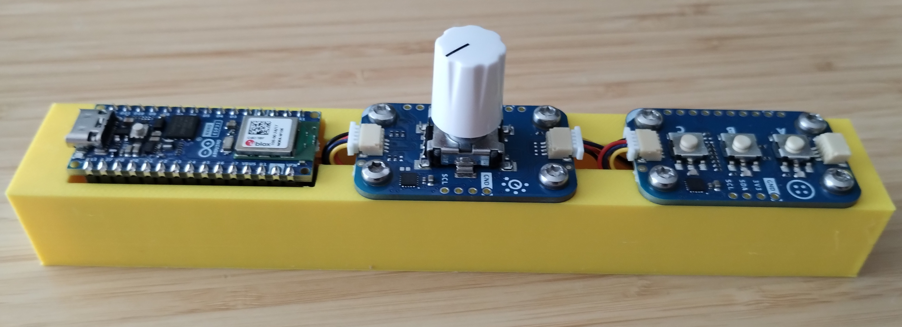
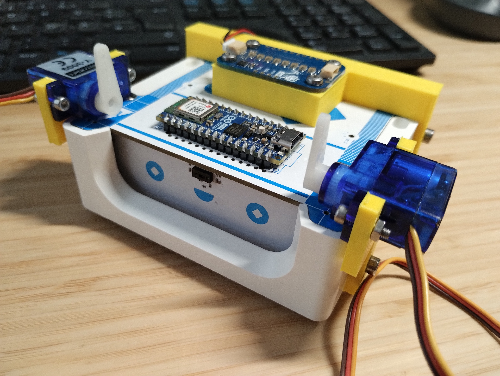

# alvik-fight-club

>
> The first rule about the Alvik fight club:
> Don’t talk about the Alvik fight club.
>

The project is composed by two components:
 - a remote controller
 - an Alvik robot

## Setup

- `make init` to install tools on local pc

### Configure the Alvik robot
1. Connect the Alvik
2. `make robot-patch-firmware`: to patch the firmware running on the STM32 (needed to resolve [Issue 10](https://github.com/bcmi-labs/alvik-fight-club/issues/10))
3. `make robot-patch-mpy`: to install the `dev` branch with of the Arduino-Alvik-mpy (Needed to resolve [Issue 10](https://github.com/bcmi-labs/alvik-fight-club/issues/10))
4. `make robot-install` to upload the `Modulino` lib
5. `make robot-get-mac` to get the `MAC` address and print it into the consle.
6. Copy the printed MAC address
7. `make robot-upload` to upload the code into the alvik

NOTE: the PATCH steps `2` and `3` are no more necessary when the [Arduino_AlvikCarrier](https://github.com/arduino-libraries/Arduino_AlvikCarrier) and the [Arduino-Alvik-mpy](https://github.com/arduino/arduino-alvik-mpy) are merged to master and release ad an official release.

### Configure the controller
1. Connect the controller
2. Install Micropython into the controller
   - Download the [Micropython Installer](https://labs.arduino.cc/en/labs/micropython-installer)
   - Open the installer and clik  `Install Micropython` button
4. `make controller-install` to install libraries into the controller
5. `make controller-upload robot-mac=<PUT_THE_ALVIK_MAC_HERE>` to upload the code and setting the MAC sddress obtained with the `make robot-get-mac` (robot Step 5).
       Example: `make controller-upload robot-mac=74:4d:bd:a0:49:e8`

## Techninal info

###  Remote controller
The remove controller is based on  `Arduino Nano ESP32` and two `Modulino`.
The remote control consists of the a 3D printed base [STL-file](cad/remote-control/remote-control.stl) and the following components:
|   | Description | Amount / € |
|---|---|:-:|
| 1 | [Arduino Nano ESP32 w/ headers](https://store.arduino.cc/products/nano-esp32-with-headers) | 23,20 € (Arduino) |
| 1 | Modulino buttons | Arduino |
| 1 | Modulino rotary encoder | Arduino |
| 2 | QWICC cables | Arduino |
| 1 | [SparkFun Qwiic Shield for Arduino Nano](https://www.sparkfun.com/products/16789) | 2,48 € |
| 8 | [M3 x 8 mm cutting screw](https://www.schraubenking.at/3-x-8mm-Flachrundkopfschraube-TX-fuer-Thermoplaste-P007210) | 1,20 € |
| 1 | Small USB battery pack | ? |
| 1 | 3D printed body | |

  

### Alvik robot
The robot is an Alvik  requires the following components:
|   | Description | Amount / € |
|---|---|:-:|
| 1 | [Arduino Alvik](https://www.arduino.cc/education/arduino-alvik/) | 158,60 € (Arduino) |
| 1 | Modulino Pixel | Arduino |
| 1 | Modulino Buzzer | Arduino |
| 2 | Servo motor (180 degree) | ~8€ |
| 1 | 3D lift mechanism | |

  

