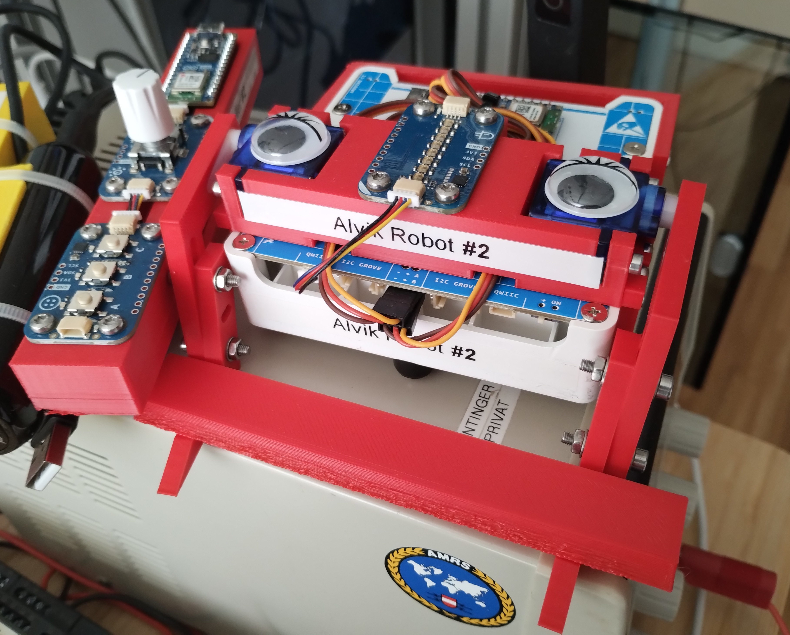

# alvik-fight-club

>
> The first rule about the Alvik fight club:
> Don’t talk about the Alvik fight club.
>

The project is composed by two components:
 - a remote controller
 - an Alvik robot

##  Remote controller
The remove controller is based on  `Arduino Nano ESP32` and two `Modulino`.
The remote control consists of the a 3D printed base [STL-file](cad/remote-control/remote-control.stl) and the following components:
|   | Description | Amount / € |
|---|---|:-:|
| 1 | [Arduino Nano ESP32 w/ headers](https://store.arduino.cc/products/nano-esp32-with-headers) | 23,20 € (Arduino) |
| 1 | Modulino buttons | Arduino |
| 1 | Modulino rotary encoder | Arduino |
| 2 | QWICC cables | Arduino |
| 1 | [SparkFun Qwiic Shield for Arduino Nano](https://www.sparkfun.com/products/16789) | 2,48 € |
| 8 | [M3 x 8 mm cutting screw](https://www.schraubenking.at/3-x-8mm-Flachrundkopfschraube-TX-fuer-Thermoplaste-P007210) | 1,20 € |
| 1 | Small USB battery pack | ? |
| 1 | 3D printed body | |

  

## Alvik robot
The robot is an Alvik  requires the following components:
|   | Description | Amount / € |
|---|---|:-:|
| 1 | [Arduino Alvik](https://www.arduino.cc/education/arduino-alvik/) | 158,60 € (Arduino) |
| 1 | Modulino Pixel | Arduino |
| 1 | Modulino Buzzer | Arduino |
| 2 | Servo motor (180 degree) | ~8€ |
| 1 | 3D lift mechanism | |

  

### Local dev
Requirements:
  - [Arduino Lab for Micropython](https://labs.arduino.cc/en/labs/micropython)
